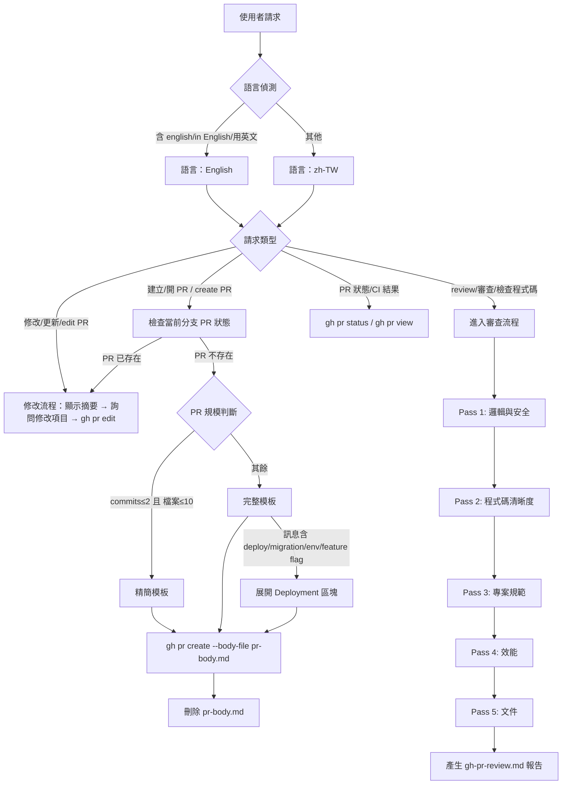

# Pull Request Skill Enhancement Implementation Plan

> **For agentic workers:** REQUIRED SUB-SKILL: Use superpowers:subagent-driven-development (recommended) or superpowers:executing-plans to implement this plan task-by-task. Steps use checkbox (`- [ ]`) syntax for tracking.

**Goal:** 將外部 PR 最佳實踐提示詞整合至 `copilot-starter:pull-request` skill，升版至 v0.4.0，強化模板品質、審查深度與 review comment 一致性。

**Architecture:** 新增一個 reference 檔案（`review-comment-style.md`）定義 comment 格式規範；更新三個現有檔案（`review-guidance.md`、`pr-template.md`、`SKILL.md`）加入新功能。全程不破壞現有 eval 結構，語言維持 zh-TW 為主。

**Tech Stack:** Markdown skill files、GitHub CLI (`gh`)、Mermaid diagram（SKILL.md 決策流程）

---

## File Map

| 路徑 | 動作 | 職責 |
|------|------|------|
| `plugins/copilot-starter/skills/pull-request/references/review-comment-style.md` | **新增** | Emoji 標籤系統 + 層級化 comment 格式規範 |
| `plugins/copilot-starter/skills/pull-request/references/review-guidance.md` | **更新** | 新增 Pass 4（效能）、Pass 5（文件）、Review Style 溝通原則 |
| `plugins/copilot-starter/skills/pull-request/references/pr-template.md` | **更新** | 精簡版 / 完整版雙模板；新增 Why、Testing Checklist、Deployment 選用區塊 |
| `plugins/copilot-starter/skills/pull-request/SKILL.md` | **更新** | 版本升至 v0.4.0、description 觸發詞、語言切換邏輯、完整 Mermaid decision tree |

---

## Task 1：新增 `review-comment-style.md`

**Files:**
- Create: `plugins/copilot-starter/skills/pull-request/references/review-comment-style.md`

- [ ] **Step 1：建立 review-comment-style.md**

內容如下：

```markdown
# PR Review Comment 格式規範

定義 PR 審查意見的格式標準，確保 review 報告一致、可掃描、易行動。

---

## 層級化格式

### Critical & Important → 完整三段 + Emoji

格式：

```
<emoji> **Issue:** <描述問題>
**Suggestion:** <具體改善方式或程式碼範例>
**Why:** <理由與影響說明>
```

範例（安全性）：

```
🔒 **Issue:** JWT token 簽發時未設定 expiry
**Suggestion:** 在 `jwt.sign()` 的 options 加入 `expiresIn: '1h'`
**Why:** 無期限 token 一旦洩漏無法撤銷，形成持續性安全漏洞
```

範例（效能）：

```
⚡ **Issue:** `getUserPosts()` 在迴圈內各自發出一次 DB query（N+1）
**Suggestion:** 改用 `include: { posts: true }` 以單次 JOIN 取得資料
**Why:** 100 個 user 會觸發 101 次查詢，在資料量大時嚴重影響回應時間
```

### Suggestion → 單行 + Emoji

格式：

```
<emoji> <描述建議>
```

範例：

```
🧹 `getUserList` 建議改為 `getUsers`，更符合 REST 命名慣例
📚 `processPayment()` 的複雜流程缺少內嵌說明，建議加上步驟註解
```

---

## Emoji 對應表

| Emoji | 類別 | 對應嚴重度 |
|-------|------|-----------|
| 🚨 | 阻擋合併的問題 | Critical |
| 🔒 | 安全性問題 | Critical / Important |
| ⚡ | 效能問題 | Important / Suggestion |
| 🧹 | 程式碼清理 | Suggestion |
| 📚 | 文件缺漏 | Suggestion |
| ✅ | 正向回饋 | — |
| 💭 | 提問釐清 | — |

---

## 嚴重程度定義

| 等級 | 定義 | 格式 |
|------|------|------|
| **Critical** | 程式崩潰、資料遺失、重大安全漏洞 | 完整三段 |
| **Important** | 違反規範、引入技術債、明顯影響維護性 | 完整三段 |
| **Suggestion** | 可改善清晰度但非錯誤 | 單行 |

---

## 報告結構

Review 報告（`gh-pr-review.md`）使用以下結構：

```markdown
## PR Review：<PR 標題>

### 摘要
[整體評估，2-3 句話]

### 議題清單

#### 🚨 Critical
[完整三段格式的 critical 問題]

#### 🔒 Important
[完整三段格式的 important 問題]

#### 建議
[單行格式的 suggestion 項目]

#### ✅ 值得稱讚
[正向回饋]

### 最終建議 (Verdict)
- **Approve** / **Request Changes** / **Comment**
- 理由說明
```
```

- [ ] **Step 2：確認檔案內容正確**

執行：
```bash
cat plugins/copilot-starter/skills/pull-request/references/review-comment-style.md
```
預期：顯示完整 markdown 內容，無截斷。

- [ ] **Step 3：Commit**

```bash
git add plugins/copilot-starter/skills/pull-request/references/review-comment-style.md
git commit -m "feat(pull-request): 新增 review-comment-style reference（Emoji 標籤 + 三段格式規範）"
```

---

## Task 2：更新 `review-guidance.md`

**Files:**
- Modify: `plugins/copilot-starter/skills/pull-request/references/review-guidance.md`

- [ ] **Step 1：閱讀現有 review-guidance.md 確認結構**

執行：
```bash
cat plugins/copilot-starter/skills/pull-request/references/review-guidance.md
```
預期：三個審查面向（邏輯/清晰度/規範）+ 噪音過濾 + 嚴重程度定義。

- [ ] **Step 2：以新版內容取代 review-guidance.md**

新版完整內容：

```markdown
# PR 審查指導原則 (zh-TW)

這是用於自動化 PR 審查的技術準則與噪音過濾規則。Comment 格式規範請參閱 `review-comment-style.md`。

---

## 審查面向（五層 Multi-Pass）

### Pass 1: 邏輯與錯誤
- **邊界條件**：陣列索引、空值（Null/Nil）檢查
- **異步處理**：Race conditions、未處理的 Promise
- **安全性**：SQL Injection 潛在點、未轉義的 HTML（XSS）、認證授權邏輯

### Pass 2: 程式碼清晰度
- **早回傳（Early Returns）**：避免過深的 `if/else` 巢狀結構
- **命名**：是否具描述性？是否需要心智解碼？
- **簡化**：是否有不必要的複雜抽象？

### Pass 3: 專案規範符合度
- 是否符合現有專案的 Coding Style？
- 測試覆蓋度是否足夠（針對 Bug Fix 與 Feature）？

### Pass 4: 效能（新增）
- **演算法複雜度**：是否有明顯的 O(n²) 或更差的操作可優化？
- **DB Query**：N+1 問題、缺少索引、可用 JOIN 取代多次查詢的場景
- **Memory leak**：未釋放的資源、持續累積的資料結構
- **快取策略**：重複計算是否可快取？網路呼叫是否可合併？

### Pass 5: 文件（新增）
- **複雜邏輯**：非直覺的演算法或業務規則是否有說明性註解？
- **README**：公開 API 或使用方式是否需同步更新？
- **API 文件**：新端點或參數變更是否反映在文件中？

---

## Review Style 溝通原則

- **正向回饋**：看到好的實作要明確標示（✅），不只指出問題
- **提問優先**：不確定意圖時用 💭 提問，不直接否定
- **具體建議**：所有意見必須附帶具體修正方向或理由（詳見 `review-comment-style.md`）
- **聚焦新增**：不回報此次 PR 未修改的既有問題

---

## 噪音過濾

1. **僅回報新增內容**：不回報原本就存在但此次未修改的舊問題
2. **信心度過濾**：僅報告信心度 > 80% 的問題
3. **忽略格式細微差別**：Linter 處理的縮排或空格問題請予忽略
4. **具體建議**：所有「建議」必須附帶具體的修正方式或理由

---

## 嚴重程度定義

| 等級 | 定義 |
|------|------|
| **Critical** | 程式崩潰、資料遺失或重大安全漏洞 |
| **Important** | 違反專案規範、引入技術債或明顯影響程式碼維護性 |
| **Suggestion** | 可改善清晰度但非錯誤的細項建議 |
```

- [ ] **Step 3：確認更新正確**

執行：
```bash
grep -n "Pass 4\|Pass 5\|Review Style" plugins/copilot-starter/skills/pull-request/references/review-guidance.md
```
預期：看到 Pass 4、Pass 5、Review Style 三行。

- [ ] **Step 4：Commit**

```bash
git add plugins/copilot-starter/skills/pull-request/references/review-guidance.md
git commit -m "feat(pull-request): 新增 Pass 4（效能）、Pass 5（文件）及 Review Style 溝通原則"
```

---

## Task 3：更新 `pr-template.md`

**Files:**
- Modify: `plugins/copilot-starter/skills/pull-request/references/pr-template.md`

- [ ] **Step 1：閱讀現有 pr-template.md 確認結構**

執行：
```bash
cat plugins/copilot-starter/skills/pull-request/references/pr-template.md
```
預期：單一版本的模板，含摘要/修改內容/風險評估/相關連結/變更類型/備註。

- [ ] **Step 2：以新版內容取代 pr-template.md**

新版完整內容：

```markdown
# Pull Request 描述範本 (v0.4.0)

這是 Pull Request 描述與標題的標準格式指南。SKILL.md 會依據 PR 規模選擇使用精簡版或完整版。

---

## 標題格式 (Conventional Commits)

標題必須嚴格遵循：`<type>(<scope>): <summary>`

### 範例：
- **功能 (Feature)**: `feat(auth): 實作 JWT 登入機制`
- **修復 (Bug Fix)**: `fix(ui): 修正購物車跳轉錯誤`
- **破壞性變更 (Breaking Change)**: `feat(api)!: 移除 v1 版本舊端點`
- **無 Scope (General)**: `chore: 更新開發套件版本`

---

## PR 規模判斷

| 條件 | 使用版本 |
|------|---------|
| commits ≤ 2 **且** 變更檔案 ≤ 10 | 精簡版 |
| 其餘情況 | 完整版 |

判斷方式：
```bash
# commit 數
git log origin/main..HEAD --oneline | wc -l

# 變更檔案數
git diff --stat origin/main..HEAD | tail -1
```

---

## 精簡版描述（Small PR）

使用時機：commits ≤ 2 且變更檔案 ≤ 10

```markdown
### 摘要
[一句話描述此 PR 核心目的]

### 修改內容
- 變更點一
- 變更點二

### 變更類型
- [ ] 新增功能 (feat)
- [ ] 修復錯誤 (fix)
- [ ] 重構 (refactor)
- [ ] 文件 (docs)
- [ ] 測試 (tests)
- [ ] 其他 (chore / ci / perf)
```

---

## 完整版描述（Standard PR）

使用時機：其餘情況

```markdown
### 摘要
[一句話總結此 PR 的核心目的]

### 修改內容
- 變更點一：描述具體的修改內容
- 變更點二：描述具體的修改內容
- 變更點三：描述具體的修改內容

### Why
**商業背景：** [說明這個變更解決什麼問題或滿足什麼需求]
**技術理由：** [說明為何採用此技術方案，有哪些備選方案被排除]

### Testing
- [ ] 單元測試通過且覆蓋新功能
- [ ] 使用者介面變更已完成手動測試
- [ ] 效能 / 安全性考量已確認

### ⚠️ 風險評估與破壞性變更
[評估此 PR 是否有破壞性變更。若無，標註：「無破壞性變更」]

常見風險：
- 資料庫 Schema 變更 (Migration)
- API 回應格式變更 (Breaking API)
- 環境變數變更 (ENV Change)

### 相關連結
- [Linear 連結](https://linear.app/...)
- [GitHub Issue] (closes #123)

### 變更類型
- [ ] 新增功能 (feat)
- [ ] 修復錯誤 (fix)
- [ ] 重構 (refactor)
- [ ] 文件 (docs)
- [ ] 測試 (tests)
- [ ] 其他 (chore / ci / perf)

### 備註（選填）
- 測試帳號、部署提示或截圖
```

---

## Deployment 區塊（選用）

**觸發條件：** 當 PR 符合下列任一情境時，應在完整版描述的「備註」前插入此區塊：(1) 使用者訊息含 `deploy`、`migration`、`env`、`feature flag` 等字詞，或明確要求加入部署清單；(2) commit 訊息包含部署 / migration / env 相關關鍵字；(3) 變更檔案路徑包含 infra / deploy / migration / helm / k8s 等目錄或檔名。

```markdown
### Deployment
- [ ] 資料庫 Migration 腳本已準備，Rollback 計畫確認
- [ ] 環境變數更新需求已列出
- [ ] Feature Flag 設定已確認
- [ ] 第三方服務整合已更新
- [ ] 相關文件已同步更新
```

---

## 標題編寫指南

1. **祈使句 (Imperative)**:
   - ✅ `feat: Add login api`
   - ❌ `feat: Added login api`
2. **首字母大寫 (Capitalized)**:
   - ✅ `fix: Resolve memory leak`
   - ❌ `fix: resolve memory leak`
3. **結尾無句點 (No period)**:
   - ✅ `docs: Update readme`
   - ❌ `docs: Update readme.`
4. **破壞性變更標記 (!)**:
   - 當變更會造成既有功能無法運作時，務必在類型後加上 `!`。
```

- [ ] **Step 3：確認雙模板存在**

執行：
```bash
grep -n "精簡版\|完整版\|Deployment" plugins/copilot-starter/skills/pull-request/references/pr-template.md
```
預期：看到精簡版、完整版、Deployment 三個標題行。

- [ ] **Step 4：Commit**

```bash
git add plugins/copilot-starter/skills/pull-request/references/pr-template.md
git commit -m "feat(pull-request): 新增精簡版/完整版雙模板，加入 Why、Testing Checklist、Deployment 選用區塊"
```

---

## Task 4：更新 `SKILL.md`

**Files:**
- Modify: `plugins/copilot-starter/skills/pull-request/SKILL.md`

- [ ] **Step 1：閱讀現有 SKILL.md 確認結構**

執行：
```bash
cat plugins/copilot-starter/skills/pull-request/SKILL.md
```
預期：版本 v0.3.0、單一 mermaid decision tree、建立/審查/修改三個流程區塊。

- [ ] **Step 2：以新版內容取代 SKILL.md**

新版完整內容：

```markdown
---
name: pull-request
description: 協助建立、修改、查看、管理或審查 (Review) GitHub Pull Request (PR)。自動分析變更內容並產生符合 Conventional Commits 規範的標題與描述。支援：(1) 從分支建立 PR、(2) 修改現有 PR、(3) 自動化程式碼審查 (Review)、(4) 檢查 PR 狀態。適用於「建立 PR」「開 PR」「create PR」「review PR」「審查」「檢查程式碼」「修改 PR」「更新描述」「PR 狀態」等請求。透過 GitHub CLI (gh) 執行。
metadata:
   version: 0.4.0
---

# GitHub Pull Request

協助使用者管理 Pull Request 生命週期，包含建立、修改及自動化程式碼審查。

## 功能

- **建立 PR**：遵循 Conventional Commits 規範，依 PR 規模自動選擇精簡版或完整版模板。
- **修改 PR**：更新現有 PR 的標題、描述、審核者或標籤。
- **PR 審查 (Review)**：分析 diff，執行五層審查，輸出結構化 review 報告。
- **狀態追蹤**：檢查當前分支的 PR 開啟狀態與 CI 檢查結果。

## 語言切換

- **預設**：所有輸出使用**繁體中文 (zh-TW)**。
- **切換條件**：使用者訊息含 `english`、`in English`、`用英文` 時，全程改用英文輸出。

## 決策流程



---

## 標題規範 (Conventional Commits)

產生的標題必須符合以下格式：
`<type>(<scope>): <summary>`

### 類型 (Types)
- `feat`: 新功能
- `fix`: 修復 Bug
- `perf`: 效能優化
- `refactor`: 程式碼重構
- `docs`: 僅文件變更
- `test`: 測試相關
- `build`/`ci`: 建置系統或 CI 配置
- `chore`: 常規維護

### 規則
- **Breaking Change**: 若有破壞性變更，在冒號前加上 `!`，例如 `feat(api)!: 修改端點`。
- **Summary**: 使用祈使句（例：Add 而非 Added），首字母大寫，結尾不加句點。

---

## 建立 PR 流程

1. **分支同步**：確認已推送到遠端，若無則自動執行 `git push -u origin <branch>`。
2. **變更分析**：
   - 執行 `git log origin/main..HEAD --oneline` 取得 commit 清單。
   - 執行 `git diff --stat origin/main..HEAD` 取得檔案變更統計。
3. **規模判斷**：commits ≤ 2 且變更檔案 ≤ 10 → 精簡版；其餘 → 完整版。
4. **內容產生**：參考 `references/pr-template.md` 產生描述。
   - 根據 commit 類型自動勾選「變更類型」checkboxes。
   - 若訊息含 `deploy`、`migration`、`env`、`feature flag` 則加入 Deployment 區塊。
5. **執行建立**：
   - **必須**使用 `pr-body.md` 暫存檔，透過 `gh pr create --body-file pr-body.md` 執行。

---

## PR 審查 (Review) 流程

當使用者要求「review PR」或「檢查程式碼」時執行：

1. **上下文獲取**：
   ```bash
   gh pr view <number> --json title,body,state
   gh pr diff <number>
   ```
2. **五層審查**（詳見 `references/review-guidance.md`）：
   - Pass 1: 邏輯與錯誤（邊界條件、安全性）
   - Pass 2: 程式碼清晰度（命名、簡化）
   - Pass 3: 專案規範符合度
   - Pass 4: 效能（DB query、演算法複雜度）
   - Pass 5: 文件（註解、README）
3. **信心過濾**：僅回報信心度 > 80% 的問題。
4. **產生報告**：將結果寫入 `gh-pr-review.md`（不 commit）。Comment 格式參閱 `references/review-comment-style.md`。

---

## 常用指令參考

詳細指令請參閱 `references/gh-pr-commands.md`。

| 功能 | 指令 |
|------|------|
| 檢查狀態 | `gh pr status` |
| 查看內容 | `gh pr view --json number,title,body` |
| 建立草稿 | `gh pr create --draft --body-file pr-body.md` |
| 修改標籤 | `gh pr edit <number> --add-label "bug,release"` |
| 查看 Diff | `gh pr diff <number>` |

---

## 注意事項

- **語言**：預設 zh-TW，使用者明確指定英文時切換（詳見「語言切換」章節）。
- **安全性**：絕對禁止在 PR 內容中洩漏 API Keys 或機密資訊。
- **暫存清理**：執行完 `gh` 指令後，務必刪除 `pr-body.md` 等暫存檔案。
```

- [ ] **Step 3：確認版本號與 decision tree 存在**

執行：
```bash
grep -n "version\|語言偵測\|PR 規模" plugins/copilot-starter/skills/pull-request/SKILL.md
```
預期：看到 `version: 0.4.0`、`語言偵測`、`PR 規模判斷` 三行。

- [ ] **Step 4：Commit**

```bash
git add plugins/copilot-starter/skills/pull-request/SKILL.md
git commit -m "feat(pull-request): 升版至 v0.4.0，加入語言切換、PR 規模判斷、五層審查 decision tree"
```

---

## Task 5：整合驗證

**Files:** 無（讀取驗證）

- [ ] **Step 1：確認四個檔案均存在**

執行：
```bash
ls plugins/copilot-starter/skills/pull-request/references/
```
預期：看到 `gh-pr-commands.md`、`pr-template.md`、`review-guidance.md`、`review-comment-style.md` 四個檔案。

- [ ] **Step 2：確認版本號一致**

執行：
```bash
grep "version\|v0.4.0" plugins/copilot-starter/skills/pull-request/SKILL.md plugins/copilot-starter/skills/pull-request/references/pr-template.md
```
預期：SKILL.md 顯示 `version: 0.4.0`，pr-template.md 顯示 `v0.4.0`。

- [ ] **Step 3：確認交叉參照正確**

執行：
```bash
grep -n "review-comment-style\|review-guidance\|pr-template" plugins/copilot-starter/skills/pull-request/SKILL.md
```
預期：SKILL.md 中有引用 `review-comment-style.md` 和 `review-guidance.md` 的段落。

- [ ] **Step 4：最終 Commit（若有任何未提交的修改）**

```bash
git status
# 若有未提交項目：
git add plugins/copilot-starter/skills/pull-request/
git commit -m "chore(pull-request): v0.4.0 整合驗證完成"
```
