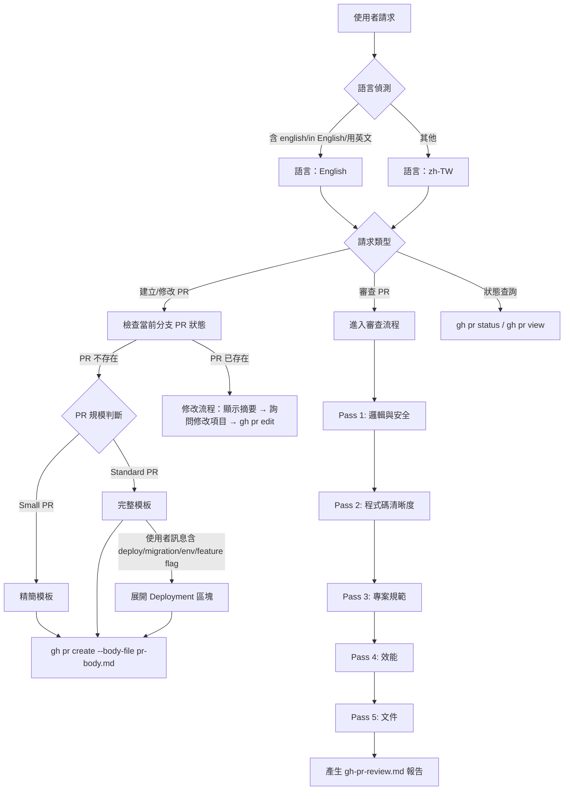

# Pull Request Skill Enhancement Design

**Date:** 2026-03-28
**Skill:** `copilot-starter:pull-request`
**Current Version:** v0.3.0
**Target Version:** v0.4.0

---

## 背景

現有 pull-request skill (v0.3.0) 已具備 PR 建立、修改、審查的基本功能。本次整合來自外部提示詞的最佳實踐，目標是在不破壞現有結構的前提下，強化模板品質、審查深度與 review comment 一致性。

---

## 設計決策摘要

| 面向 | 決策 |
|------|------|
| 語言 | 預設 zh-TW，使用者明確指定（english / in English / 用英文）時切換 |
| PR 模板 | 合併現有結構，依 PR 規模（small / standard）提供兩種版本 |
| Deployment 區塊 | 選用，使用者明確要求時才展開 |
| Review Comment | Emoji 標籤 + 三段結構（Critical/Important 用完整格式，Suggestion 用單行） |
| 觸發詞 | description 欄位放關鍵字，SKILL.md 主體放完整 decision tree |

---

## 檔案變更範圍

| 檔案 | 動作 | 說明 |
|------|------|------|
| `SKILL.md` | 更新 | 觸發詞分類、語言切換邏輯、完整 decision tree、Deployment 選用說明 |
| `references/pr-template.md` | 更新 | 精簡版 / 完整版雙模板，新增 Why 與 Testing Checklist 區塊 |
| `references/review-guidance.md` | 更新 | 新增 Pass 4（效能）、Pass 5（文件）、Review Style 溝通原則 |
| `references/review-comment-style.md` | 新增 | Emoji 標籤系統 + 層級化 comment 格式規範 |

---

## Section 1：PR 模板結構

### PR 規模判斷條件

```
Small PR：commits ≤ 2 且 diff stat ≤ 10 個檔案
Standard PR：其餘情況
```

### 精簡模板（Small PR）

```markdown
### 摘要
[一句話描述此 PR 核心目的]

### 修改內容
- 變更點一
- 變更點二

### 變更類型
- [ ] 新增功能 (feat)
- [ ] 修復錯誤 (fix)
- [ ] 重構 (refactor)
- [ ] 文件 (docs)
- [ ] 測試 (tests)
- [ ] 其他 (chore / ci / perf)
```

### 完整模板（Standard PR）

```markdown
### 摘要
[一句話描述此 PR 核心目的]

### 修改內容
- 變更點一：描述具體的修改內容
- 變更點二：描述具體的修改內容

### Why
**商業背景：** [說明這個變更解決什麼問題或滿足什麼需求]
**技術理由：** [說明為何採用此技術方案]

### Testing
- [ ] 單元測試通過且覆蓋新功能
- [ ] 使用者介面變更已完成手動測試
- [ ] 效能 / 安全性考量已確認

### ⚠️ 風險評估與破壞性變更
[評估是否有破壞性變更。若無，標註：「無破壞性變更」]

常見風險：
- 資料庫 Schema 變更 (Migration)
- API 回應格式變更 (Breaking API)
- 環境變數變更 (ENV Change)

### 相關連結
- [Linear 連結](https://linear.app/...)
- [GitHub Issue] (closes #123)

### 變更類型
- [ ] 新增功能 (feat)
- [ ] 修復錯誤 (fix)
- [ ] 重構 (refactor)
- [ ] 文件 (docs)
- [ ] 測試 (tests)
- [ ] 其他 (chore / ci / perf)

### Deployment（選用）
> 僅在使用者明確要求時展開此區塊

- [ ] 資料庫 Migration 及 Rollback 計畫
- [ ] 環境變數更新需求
- [ ] Feature Flag 設定
- [ ] 第三方服務整合更新
- [ ] 文件更新完成

### 備註（選填）
- 測試帳號、部署提示或截圖
```

---

## Section 2：審查流程更新

### 五層審查（Multi-Pass）

**Pass 1: 邏輯與錯誤（現有）**
- 邊界條件：陣列索引、空值（Null/Nil）檢查
- 非同步處理：Race conditions、未處理的 Promise
- 安全性：SQL Injection、未轉義的 HTML（XSS）

**Pass 2: 程式碼清晰度（現有）**
- 早回傳（Early Returns）：避免過深的 if/else 巢狀結構
- 命名：是否具描述性，是否需要心智解碼
- 簡化：是否有不必要的複雜抽象

**Pass 3: 專案規範符合度（現有）**
- 是否符合現有專案 Coding Style
- 測試覆蓋度是否足夠

**Pass 4: 效能（新增）**
- 演算法複雜度評估
- DB query 優化機會（N+1、缺少索引）
- Memory leak 風險
- 快取策略與網路呼叫效率

**Pass 5: 文件（新增）**
- 程式碼註解是否充足（複雜邏輯需說明）
- README 是否需要同步更新
- API 文件是否反映新變更

### Review Style 溝通原則（新增）

- **正向回饋：** 看到好的實作明確標示（✅），不只指出問題
- **提問優先：** 不確定意圖時用 💭 提問，不直接否定
- **具體建議：** 所有意見必須附帶具體修正方向或理由
- **聚焦新增：** 不回報此次 PR 未修改的既有問題

### 噪音過濾（現有，保留）

- 僅回報信心度 > 80% 的問題
- 忽略 Linter 處理的格式細微差別

---

## Section 3：Decision Tree 與觸發詞

### SKILL.md description 欄位觸發詞（關鍵字）

**建立類：** 「建立 PR」、「開 PR」、「幫我開 PR」、「create PR」、「create pull request」
**審查類：** 「review PR」、「審查」、「檢查程式碼」、「review pull request」
**修改類：** 「修改 PR」、「更新描述」、「edit PR」
**狀態類：** 「PR 狀態」、「CI 結果」、「gh pr status」

### 完整 Decision Tree（SKILL.md 主體）



---

## Section 4：Review Comment 格式規範

### 層級化格式

**Critical & Important → 完整三段 + Emoji**

```
🔒 **Issue:** JWT token 未設定 expiry
**Suggestion:** 加入 `expiresIn: '1h'` 至 signOptions
**Why:** 無期限 token 洩漏後無法撤銷，形成持續性安全漏洞
```

**Suggestion → 單行 + Emoji**

```
🧹 `getUserList` 建議改為 `getUsers`，更符合 REST 命名慣例
```

### Emoji 對應表

| Emoji | 類別 | 對應嚴重度 |
|-------|------|-----------|
| 🚨 | 阻擋合併的問題 | Critical |
| 🔒 | 安全性問題 | Critical / Important |
| ⚡ | 效能問題 | Important / Suggestion |
| 🧹 | 程式碼清理 | Suggestion |
| 📚 | 文件缺漏 | Suggestion |
| ✅ | 正向回饋 | — |
| 💭 | 提問釐清 | — |

### 嚴重程度定義（現有，保留）

- **Critical：** 會造成程式崩潰、資料遺失或重大安全漏洞
- **Important：** 違反專案規範、引入技術債或明顯影響程式碼維護性
- **Suggestion：** 可改善清晰度但非錯誤的細項建議

---

## 不在本次範圍內

- Evals 重跑（`evals/evals.json`）：模板變更後由使用者決定是否更新
- `gh-pr-commands.md`：現有指令參考無需更動
- 版本號以外的 metadata 欄位調整

---

## 實作順序建議

1. `references/review-comment-style.md`（新增，無依賴）
2. `references/review-guidance.md`（更新，加入 Pass 4/5 + 溝通原則）
3. `references/pr-template.md`（更新，雙模板）
4. `SKILL.md`（更新，decision tree + 觸發詞 + 語言切換）
