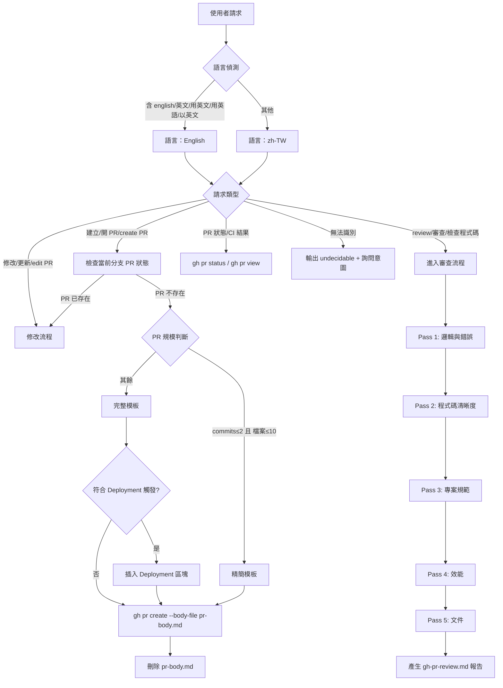

# GitHub Pull Request

協助使用者管理 Pull Request 生命週期，包含建立、修改及自動化程式碼審查。

## 功能

- **建立 PR**：遵循 Conventional Commits 規範，依 PR 規模自動選擇精簡版或完整版模板。
- **修改 PR**：更新現有 PR 的標題、描述、審核者或標籤。
- **PR 審查 (Review)**：分析 diff，執行五層審查，輸出結構化 review 報告。
- **狀態追蹤**：檢查當前分支的 PR 開啟狀態與 CI 檢查結果。

## 語言切換

- **預設**：所有輸出使用**繁體中文 (zh-TW)**。
- **切換條件**：使用者訊息含 `english`、`in English`、`用英文`、`英文`、`用英語`、`以英文` 任一字詞時，全程改用英文輸出。

## 決策流程



### 主流程路由規則（衛述句 / Guard Clause 文字版）

請嚴格按照以下順序評估，一旦滿足某項規則，立即執行對應動作並終止後續判斷。

**語言判斷（最優先）**

規則 L1：若使用者訊息含 `english`、`in English`、`用英文`、`英文`、`用英語`、`以英文` 任一字詞，則全程使用英文輸出。
規則 L2：否則，使用繁體中文 (zh-TW) 輸出。

**請求類型判斷**

規則一：若請求含「建立」「開 PR」「create PR」「new PR」「make a PR」等建立意圖，則進入建立 PR 流程。
規則二：若請求含「review」「審查」「審閱」「檢查程式碼」「code review」等審查意圖，則進入 PR 審查流程。
規則三：若請求含「修改」「更新」「edit PR」「update PR」「改描述」「改標題」等修改意圖，則進入修改 PR 流程。
規則四：若請求含「狀態」「CI」「check」「status」「PR 有沒有過」等查詢意圖，則執行 `gh pr status` 或 `gh pr view` 並顯示結果。
回退規則：若請求無法明確歸類至上述任何意圖，輸出 `<undecidable>` 並詢問：「請問你想要建立新 PR、審查現有 PR、修改 PR 描述，還是查看 PR 狀態？」

**PR 規模判斷（建立 PR 流程專用）**

規則 S1：若 commits ≤ 2 且 變更檔案 ≤ 10，則使用精簡版模板。
規則 S2：其餘情況，使用完整版模板；若同時符合 Deployment 觸發條件（詳見 `references/pr-template.md`），則在完整版「備註」前插入 Deployment 區塊。

---

## 標題規範 (Conventional Commits)

產生的標題必須符合以下格式：
`<type>(<scope>): <summary>`

### 類型 (Types)
- `feat`: 新功能
- `fix`: 修復 Bug
- `perf`: 效能優化
- `refactor`: 程式碼重構
- `docs`: 僅文件變更
- `test`: 測試相關
- `build`/`ci`: 建置系統或 CI 配置
- `chore`: 常規維護

### 規則
- **Breaking Change**: 若有破壞性變更，在冒號前加上 `!`，例如 `feat(api)!: 修改端點`。
- **Summary**: 使用祈使句（例：Add 而非 Added），首字母大寫，結尾不加句點。

---

## 建立 PR 流程

1. **分支同步**：確認已推送到遠端，若無則自動執行 `git push -u origin <branch>`。
2. **變更分析**：
   - 執行 `git log origin/main..HEAD --oneline | wc -l` 取得 commit 數量。
   - 執行 `git diff --name-only origin/main..HEAD | wc -l` 取得變更檔案數。
3. **規模判斷與模板選擇**（參考 `references/pr-template.md`）：
   - commits ≤ 2 **且** 變更檔案 ≤ 10 → 使用**精簡版**模板。
   - 其餘情況 → 使用**完整版**模板。
   - Deployment 觸發條件詳見 `references/pr-template.md` Deployment 區塊說明。
4. **內容產生**：根據判斷結果填寫對應模板，並根據 commit 類型自動勾選「變更類型」checkboxes。
5. **執行建立**：
   - **必須**使用 `pr-body.md` 暫存檔，透過 `gh pr create --body-file pr-body.md` 執行。
6. **清理暫存檔**：執行完成後立即刪除 `pr-body.md`。

---

## 修改 PR 流程

當使用者要求「修改 PR」「更新描述」「edit PR」或 PR 已存在時自動進入此流程：

1. **顯示現有 PR 摘要**：
   ```bash
   gh pr view --json number,title,body,labels,assignees
   ```
2. **詢問修改項目**：確認使用者要修改的欄位（標題、描述、標籤、審核者等）。
3. **執行修改**：依使用者指定的欄位執行對應指令：
   - 標題：`gh pr edit <number> --title "<新標題>"`
   - 描述：將新描述寫入 `pr-body.md`，執行 `gh pr edit <number> --body-file pr-body.md`，完成後刪除 `pr-body.md`
   - 標籤：`gh pr edit <number> --add-label "<label>" --remove-label "<label>"`
   - 審核者：`gh pr edit <number> --add-reviewer "<username>"`

---

## PR 審查 (Review) 流程

當使用者要求「review PR」或「檢查程式碼」時執行：

1. **上下文獲取**：
   ```bash
   gh pr view <number> --json title,body,state
   gh pr diff <number>
   ```
2. **五層審查**（詳見 `references/review-guidance.md`）：
   - Pass 1: 邏輯與錯誤（邊界條件、安全性）
   - Pass 2: 程式碼清晰度（命名、簡化）
   - Pass 3: 專案規範符合度
   - Pass 4: 效能（DB query、演算法複雜度）
   - Pass 5: 文件（註解、README）
3. **信心過濾**：僅回報信心度 > 80% 的問題。
4. **產生報告**：將結果寫入 `gh-pr-review.md`（不 commit）。報告須包含：摘要、議題清單（🚨 Critical / ⚠️ Important / 建議 / ✅ 值得稱讚）、最終建議（Verdict）。Comment 與報告格式參閱 `references/review-comment-style.md`（⚠️ 定義於 Emoji 對應表）。

---

## 常用指令參考

詳細指令請參閱 `references/gh-pr-commands.md`。

| 功能 | 指令 |
|------|------|
| 檢查狀態 | `gh pr status` |
| 查看內容 | `gh pr view --json number,title,body` |
| 建立草稿 | `gh pr create --draft --body-file pr-body.md` |
| 修改標籤 | `gh pr edit <number> --add-label "bug,release"` |
| 查看 Diff | `gh pr diff <number>` |

---

## 注意事項

- **語言**：預設 zh-TW，使用者明確指定英文時切換（詳見「語言切換」章節）。
- **安全性**：絕對禁止在 PR 內容中洩漏 API Keys 或機密資訊。
- **暫存清理**：執行完 `gh` 指令後，務必刪除 `pr-body.md` 等暫存檔案。
