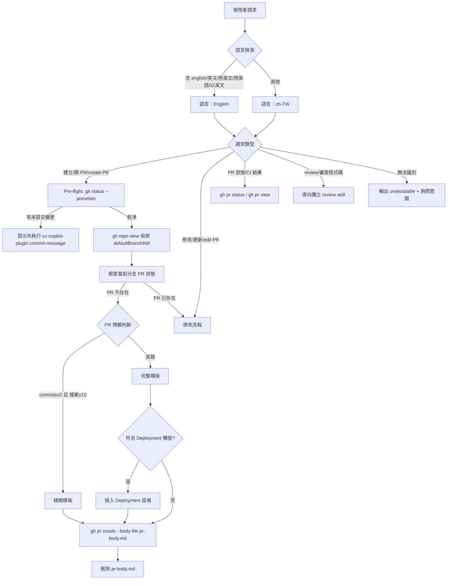

# GitHub Pull Request

建立與維護 GitHub Pull Request，涵蓋 PR 建立、描述/標題/標籤/審核者更新以及狀態查詢。**程式碼審查 (code review) 不在此 skill 範圍內，請使用獨立的 review skill。**

**前置需求**：已安裝並登入 GitHub CLI (`gh auth status` 通過)。

## 功能

- **建立 PR**：遵循 Conventional Commits 規範，依 PR 規模自動選擇精簡版或完整版模板。
- **修改 PR**：更新現有 PR 的標題、描述、審核者或標籤。
- **狀態追蹤**：檢查當前分支的 PR 開啟狀態與 CI 檢查結果。

## 語言切換

- **預設**：所有輸出使用**繁體中文 (zh-TW)**。
- **切換條件**：使用者訊息含 `english`、`in English`、`用英文`、`英文`、`用英語`、`以英文` 任一字詞時，全程改用英文輸出。

## 決策流程



### 主流程路由規則（衛述句 / Guard Clause 文字版）

請嚴格按照以下順序評估，一旦滿足某項規則，立即執行對應動作並終止後續判斷。

**語言判斷（最優先）**

規則 L1：若使用者訊息含 `english`、`in English`、`用英文`、`英文`、`用英語`、`以英文` 任一字詞，則全程使用英文輸出。
規則 L2：否則，使用繁體中文 (zh-TW) 輸出。

**請求類型判斷**

規則一：若請求含「建立」「開 PR」「create PR」「new PR」「make a PR」等建立意圖，則進入建立 PR 流程。
規則二：若請求含「修改」「更新」「edit PR」「update PR」「改描述」「改標題」等修改意圖，則進入修改 PR 流程。
規則三：若請求含「狀態」「CI」「check」「status」「PR 有沒有過」等查詢意圖，則執行 `gh pr status` 或 `gh pr view` 並顯示結果。
規則四：若請求含「review」「審查」「審閱」「檢查程式碼」「code review」等審查意圖，**不在本 skill 範圍**，請回覆使用者並建議改用獨立的 PR review skill。
回退規則：若請求無法明確歸類至上述任何意圖，輸出 `<undecidable>` 並詢問：「請問你想要建立新 PR、修改 PR 描述，還是查看 PR 狀態？」

**PR 規模判斷（建立 PR 流程專用）**

規則 S1：若 commits ≤ 2 且 變更檔案 ≤ 10，則使用精簡版模板。
規則 S2：其餘情況，使用完整版模板；若同時符合 Deployment 觸發條件（詳見 `references/pr-template.md`），則在完整版「備註」前插入 Deployment 區塊。

---

## 標題規範 (Conventional Commits)

產生的標題必須符合以下格式：
`<type>(<scope>): <summary>`

### 類型 (Types)
- `feat`: 新功能
- `fix`: 修復 Bug
- `perf`: 效能優化
- `refactor`: 程式碼重構
- `docs`: 僅文件變更
- `test`: 測試相關
- `build`/`ci`: 建置系統或 CI 配置
- `chore`: 常規維護

### 規則
- **Breaking Change**: 若有破壞性變更，在冒號前加上 `!`，例如 `feat(api)!: 修改端點`。
- **Summary**: 使用祈使句（例：Add 而非 Added），首字母大寫，結尾不加句點。

---

## 建立 PR 流程

### Step 1：Pre-flight 檢查未提交變更

```bash
git status --porcelain
```

- **輸出非空**：停止流程，提示使用者先執行 `cc-copilot-plugin:commit-message` skill 完成提交。
- **輸出為空**：繼續下一步。

### Step 2：偵測預設分支並同步

```bash
# 動態取得 base branch，取代硬編的 origin/main
BASE=$(gh repo view --json defaultBranchRef --jq '.defaultBranchRef.name')

# 確認已推送到遠端；若尚未推送則自動建立追蹤分支
git push -u origin HEAD 2>/dev/null || true
```

### Step 3：變更分析

```bash
git log "origin/$BASE..HEAD" --oneline | wc -l        # commit 數
git diff --name-only "origin/$BASE..HEAD" | wc -l     # 變更檔案數
git diff "origin/$BASE...HEAD"                         # 完整 diff（必要時參考）
```

### Step 4：模板選擇（參考 `references/pr-template.md`）

- commits ≤ 2 **且** 變更檔案 ≤ 10 → **精簡版**模板。
- 其餘 → **完整版**模板；若符合 Deployment 觸發條件，在「備註」前插入 Deployment 區塊。

### Step 5：內容產生

根據規模判斷填寫對應模板，並：
- 依 commit 類型自動勾選「變更類型」checkboxes。
- 於描述中加入 Issue 參照（語法見 `references/pr-template.md` 的 Issue 參照表）。
- **禁止**於描述中出現客戶/組織名稱、使用者 email、support ticket 原文或任何 PII；描述技術症狀即可，必要時以內部單號連結。

### Step 6：執行建立

繁體中文內容必須透過**檔案輸入**給 gh，避免在 Windows cmd / PowerShell 預設 cp950 終端機下被 shell 位元組層破壞。

```bash
# 先確認 pr-body.md 為 UTF-8 無 BOM（見下方「編碼規範」）
gh pr create \
  --draft \
  --body-file pr-body.md \
  --title "<type>(<scope>): <summary>"
```

- **描述**：一律用 `--body-file`，**禁止**用 `--body "$(cat pr-body.md)"` 或 heredoc 直接傳字串——那會走 shell 展開。
- **標題含中文 + Windows 非 UTF-8 終端機（cmd / PowerShell 預設 cp950）**：`gh pr create` 無 `--title-file` 旗標，直接傳字串等於 shell 展開，**無法**透過 `"$(cat file)"` 規避。此情境只能使用下列二段式：
  ```bash
  # Step A：用 ASCII 占位標題建立草稿 PR，取得 PR 編號
  gh pr create --draft --body-file pr-body.md --title "chore: draft (title pending)"

  # Step B：立即以 gh api PATCH 的 @file 模式覆寫真實標題
  printf '%s' "<type>(<scope>): <summary>" > pr-title.txt
  gh api -X PATCH "repos/:owner/:repo/pulls/<新建立的 PR number>" -f title=@pr-title.txt
  rm -f pr-title.txt
  ```
  git-bash / WSL / macOS / Linux 終端機預設 UTF-8，可直接傳標題；Windows 使用者也可於同 session 先執行 `chcp 65001` 後再單段建立。

建議以 `--draft` 建立，確認 CI 通過再 `gh pr ready <number>` 轉正式。

### Step 7：清理暫存檔

```bash
rm -f pr-body.md pr-title.txt
```

即使 `gh pr create` 失敗也務必清除，避免殘留檔案。

---

## 修改 PR 流程

當使用者要求「修改 PR」「更新描述」「edit PR」或 PR 已存在時自動進入此流程。

> **重要**：`gh pr edit` 對 title/body 的更新因 GitHub Projects (classic) 棄用而已不可靠，請改用 `gh api -X PATCH` 直接呼叫 REST API。標籤與審核者仍可使用 `gh pr edit`。

### Step 1：顯示現有 PR 摘要

```bash
gh pr view --json number,title,body,labels,assignees
```

### Step 2：確認修改項目

詢問使用者要修改的欄位（標題、描述、標籤、審核者等）。

### Step 3：執行修改

> **重要**：所有含中文的欄位 (title / body) **必須**以 gh 的 `@filename` 語法讀檔，由 gh 以 UTF-8 位元組直接送出；不可用 `-f body="$(cat file)"` 讓 shell 展開，否則在 Windows cmd / PowerShell 下會因 cp950 轉碼產生亂碼。檔案必須為 UTF-8 無 BOM（見下方「編碼規範」）。

- **僅更新描述**：先把內容寫入 `pr-body.md`，再：
  ```bash
  gh api -X PATCH "repos/:owner/:repo/pulls/<number>" -f body=@pr-body.md
  rm -f pr-body.md
  ```
- **僅更新標題**：
  ```bash
  # 標題短可直接傳；若終端機非 UTF-8 且標題含中文，改用檔案模式
  gh api -X PATCH "repos/:owner/:repo/pulls/<number>" -f title='<新標題>'

  # 檔案模式（避免 cp950 亂碼）
  printf '%s' '<新標題>' > pr-title.txt
  gh api -X PATCH "repos/:owner/:repo/pulls/<number>" -f title=@pr-title.txt
  rm -f pr-title.txt
  ```
- **標題 + 描述一次更新**：
  ```bash
  printf '%s' '<新標題>' > pr-title.txt
  gh api -X PATCH "repos/:owner/:repo/pulls/<number>" \
    -f title=@pr-title.txt \
    -f body=@pr-body.md
  rm -f pr-body.md pr-title.txt
  ```
- **標籤**：`gh pr edit <number> --add-label "<label>" --remove-label "<label>"`
- **審核者**：`gh pr edit <number> --add-reviewer "<username>"`

> 若 `gh pr edit` 的 label / reviewer 更新回報錯誤，改用 REST：
> - 加標籤：`gh api -X POST "repos/:owner/:repo/issues/<number>/labels" -f "labels[]=<label>"`
> - 加審核者：`gh api -X POST "repos/:owner/:repo/pulls/<number>/requested_reviewers" -f "reviewers[]=<user>"`

---

## 常用指令參考

詳細指令請參閱 `references/gh-pr-commands.md`。

| 功能 | 指令 |
|------|------|
| 偵測預設分支 | `gh repo view --json defaultBranchRef --jq '.defaultBranchRef.name'` |
| 檢查狀態 | `gh pr status` |
| 查看內容 | `gh pr view --json number,title,body` |
| 建立草稿 | `gh pr create --draft --body-file pr-body.md` |
| 更新標題/描述 | `gh api -X PATCH "repos/:owner/:repo/pulls/<n>" -f title=... -f body=...` |
| 修改標籤 | `gh pr edit <number> --add-label "bug,release"` |
| 查看 Diff | `gh pr diff <number>` |

---

## 編碼規範（防止網頁亂碼）

繁體中文 PR 在 GitHub 網頁顯示亂碼的根因是 **shell 在把字串送進 `gh` 前就做了錯誤轉碼**（Windows cmd / PowerShell 預設 cp950，把 UTF-8 位元組當成 big5 重新編碼）。

### 防堵規則

1. **描述一律走檔案輸入**：使用 `--body-file pr-body.md`（建立）或 `-f body=@pr-body.md`（修改），讓 gh 以 UTF-8 位元組直接讀檔，繞過 shell。
2. **嚴禁 shell 展開中文字串**：禁止使用 `--body "$(cat file)"`、`-f body="$(cat file)"` 或 heredoc 內嵌中文傳給 `gh`。
3. **檔案必須是 UTF-8 無 BOM**：透過本 skill 的 Write 工具產生的檔案已符合；若由其他工具產生，需驗證（見下方）。
4. **含中文標題**：若執行環境為 Windows 非 UTF-8 終端機，標題也走檔案（`-f title=@pr-title.txt`）。
5. **可選環境強化**（使用者端）：Windows cmd / PowerShell 可先 `chcp 65001` 切 UTF-8；git-bash / WSL / macOS / Linux 預設即為 UTF-8。

### 驗證步驟

送出前可快速確認 `pr-body.md` 編碼：

```bash
# 檢查是否有 BOM（UTF-8 BOM 為 EF BB BF）。輸出不應以 efbbbf 開頭。
head -c 3 pr-body.md | od -An -tx1

# file 工具可直接判斷（若可用）
file pr-body.md         # 期望：UTF-8 Unicode text

# 目視抽樣：確認中文正確解碼
head -5 pr-body.md
```

若檢出 BOM，重新產生檔案即可（Write 工具預設不寫 BOM）。

---

## 注意事項

- **語言**：預設 zh-TW，使用者明確指定英文時切換（詳見「語言切換」章節）。
- **客戶資料 / PII**：描述中**禁止**出現客戶/組織名稱、使用者 email、support ticket 原文或其他 PII。描述技術症狀，必要時以內部單號（例：`Refs INTERNAL-1234`）連結。PR 在 open-source repo 通常公開可見。
- **安全性**：絕對禁止在 PR 內容中洩漏 API Keys、Token 或任何機密資訊。
- **暫存清理**：執行完 `gh` 指令後，務必刪除 `pr-body.md`、`pr-title.txt` 等暫存檔案（即使指令失敗）。
- **編碼**：所有含中文欄位走 `@filename` / `--body-file` 路徑，檔案為 UTF-8 無 BOM（詳見「編碼規範」）。
- **範圍邊界**：本 skill 不處理 PR code review、程式碼審查與 review 報告產出——請改用獨立的 review skill。
