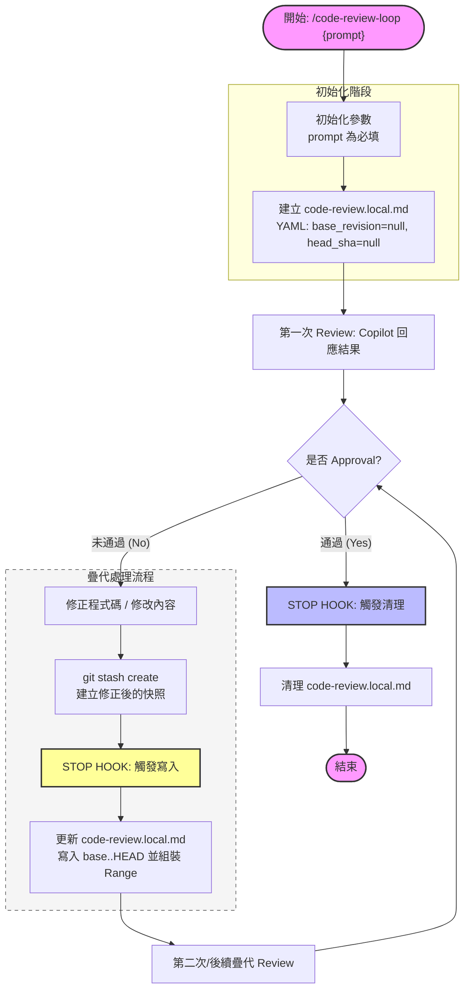

# code-review Plugin

Automated code review loop plugin for Claude Code. It keeps the **writer/fixer** role inside Claude Code separate from the **reviewer** role handled by a Copilot CLI subagent, so the author never reviews their own work.

The loop terminates only when the reviewer's persisted report ends with the exact terminator token on its final non-empty line:

```text
<promise>APPROVAL</promise>
```

## Prerequisites

- Claude Code with plugin support enabled
- `copilot` CLI installed and available on `PATH`
- A git repository (the loop snapshots diffs between iterations)

Verify Copilot CLI:

```bash
copilot --version
```

## Installation

Install the plugin from this marketplace repository:

```text
/plugin marketplace add gn00678465/cc-copilot-plugins
/plugin install code-review@cc-copilot-plugins
/reload-plugins
```

## Skills

### `/code-review-loop`

Starts the automated review-fix loop.

```text
/code-review-loop PROMPT [--max-iterations N] [--model MODEL_NAME] [--mode claude|copilot]
```

| Option | Default | Description |
|--------|---------|-------------|
| `PROMPT` | *(required)* | Review context, target scope, or specific concerns |
| `--max-iterations N` | `3` | Maximum review iterations before the loop is suspended; use `0` for unlimited |
| `--model MODEL_NAME` | `gpt-5.4` | Copilot model used by the reviewer subagent |
| `--mode claude\|copilot` | `claude` | State/report directory written by the scripts: `.claude\` or `.copilot\` |

**Examples**

```text
/code-review-loop Review the staged changes for quality
/code-review-loop Review the auth module for security issues --max-iterations 5
/code-review-loop Refactor cache layer --model gpt-5-mini --max-iterations 0
```

### `/continue-loop`

Continues a running or suspended loop — immediately re-runs the Copilot reviewer on the writer's latest diff, advances `iteration`, and optionally raises the cap. Symmetric with `/cancel-review`: one extends the loop, the other discards it.

```text
/continue-loop [--max-iterations N]
```

| Option | Default | Description |
|--------|---------|-------------|
| `--max-iterations N` | *(unchanged)* | New **absolute** cap (not additive). Required when the loop is already at its cap. `N = 0` means unlimited; otherwise `N` must be greater than the current `iteration`. |

**When to use**

- The loop was suspended after hitting `--max-iterations` and you want to resume it.
- The loop is still running under the current cap but you want to re-run the reviewer on new fixes now, without waiting for the Stop hook.
- You want to raise the cap mid-loop.

**Examples**

```text
/continue-loop
/continue-loop --max-iterations 5
```

State lifecycle is unchanged: `/continue-loop` **never clears state**. Only reviewer approval (detected by the Stop hook) clears state. Use `/cancel-review` to discard explicitly.

**Mode caveat.** The packaged Stop hook is wired for `--mode claude` only. If the loop was started with `--mode copilot`, `/continue-loop` still loads and advances state from `.copilot\code-review.local.md` correctly, but the Stop hook will not roll the next iteration automatically — wire the matching hook yourself (see the *Stop hook* section below).

### `/cancel-review`

Cancels an active loop and removes the plugin state/report files.

```text
/cancel-review
```

If no active loop exists, the skill reports that nothing is running. In the packaged plugin configuration, `/cancel-review` clears the default `.claude\code-review.local.md` and `.claude\code-review.last-report.md` files.

## Role separation

Inside `/code-review-loop` the roles are intentionally split:

- **Reviewer**: external Copilot CLI subagent
- **Writer / fixer**: the current Claude Code session

Only the reviewer is allowed to emit `<promise>APPROVAL</promise>`. The writer/fixer must only read the report, fix the flagged issues, and exit the turn so the Stop hook can decide whether to continue.

## How the loop works



1. `reviewer.js` creates `.<mode>\code-review.local.md` with YAML frontmatter and immediately invokes the Copilot reviewer.
2. The reviewer's full output is streamed back into the session and persisted to `.<mode>\code-review.last-report.md`.
3. You fix the reported `Critical` and `Important` findings, then end your turn.
4. When Claude Code tries to exit, `session-stop.js` runs:
   - If `code-review.last-report.md` ends with `<promise>APPROVAL</promise>` on its final non-empty line, the hook clears state/report files and allows exit.
   - If `--max-iterations` has been reached, the loop is **suspended** and state is preserved. Run `/continue-loop [--max-iterations N]` to resume, or `/cancel-review` to discard.
   - Otherwise, the hook snapshots the new diff, increments the iteration, re-runs the reviewer on `git diff <base>..<head>`, and overwrites the persisted report for the next round.
5. The cycle repeats until the reviewer approves or you explicitly cancel the loop.

For the full state-machine, role-separation rules, and concurrency / session-isolation model, see [`docs/flow.md`](docs/flow.md).

## Concurrency

`code-review.local.md` is a project-level file. To keep two parallel loops in the same workspace from colliding, the plugin binds each loop to the activating session's `session_id`:

1. The `UserPromptExpansion` hook writes the activating `session_id` into `.claude/code-review.pending-session.txt`.
2. `reviewer.js` / `continue.js` reads (and removes) the sidecar at startup and records the id into `state.session_id`.
3. The `Stop` hook only drives the loop when the incoming `session_id` matches `state.session_id`. Foreign sessions are silently ignored.

Run `node plugins/code-review/scripts/test/run-all.js` to exercise the isolation, state-lifecycle, and prompt-composition contracts.

## State files

The plugin stores loop state in `.<mode>\code-review.local.md` and the latest reviewer output in `.<mode>\code-review.last-report.md`.

Example state file:

```yaml
---
active: true
iteration: 2
max_iterations: 3
completion_promise: "APPROVAL"
started_at: "2026-04-23T08:52:12Z"
model: "gpt-5.4"
mode: "claude"
base_revision: "20a94c9902b594ae982cc58744478a61a5a378af"
head_sha: "ea21647a2a1d2e1a2dbcac48753b17373b6f3b2c"
initial_head: "20a94c9902b594ae982cc58744478a61a5a378af"
session_id: "a1b2c3d4-..."
---

Review the staged changes for quality
```

## Monitoring

```powershell
# Inspect current state
Get-Content .claude\code-review.local.md -TotalCount 20

# Inspect the latest reviewer report
Get-Content .claude\code-review.last-report.md -Tail 40
```

If you start the loop with `--mode copilot`, inspect `.copilot\` instead of `.claude\`.

## Stop hook

The plugin registers a Stop hook:

```text
node ${CLAUDE_PLUGIN_ROOT}/scripts/session-stop.js claude
```

The packaged hook reads `.claude\code-review.last-report.md` as the source of truth for approval. It does **not** inspect the writer/fixer's last message, which avoids false positives from quoted or paraphrased approval text.

If you want to run the loop against `.copilot\`, you must also wire the matching hook command yourself:

```text
node ${CLAUDE_PLUGIN_ROOT}/scripts/session-stop.js copilot
```

## Roadmap

1. Fix `--mode copilot` so the packaged hook and related skills work out of the box with `.copilot\`.
2. Explore switching the reviewer invocation from the current CLI flow to `copilot --acp`.
