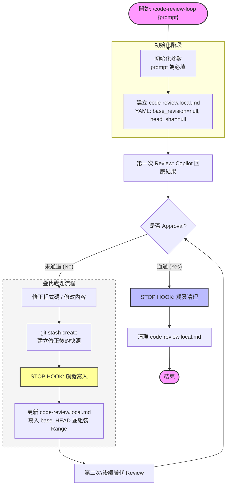

# Code Review Loop — 流程規格

本文件是 `/code-review-loop` 的權威流程定義；script 與 SKILL.md 都以此為依據。

## 流程圖

## 規則

0. `prompt` 為必填，其餘參數有預設值（`--max-iterations`、`--model`、`--mode`）。
1. 啟動時 `code-review.local.md` frontmatter 必須包含 `base_revision: null` 與 `head_sha: null`。
2. 第一輪 reviewer 只收到使用者 prompt（不附 `base..head` range）。
3. 第二輪起由 Stop hook 觸發 `git stash create`，將上一輪 head 當 `base_revision`、新 stash hash 當 `head_sha` 寫回 state，並組成 `base..head` range 給 reviewer。
4. 每輪結束都會以 stash hash 更新 `head_sha`；下一輪的 `base_revision` 是上一輪的 `head_sha`。
5. 只有 reviewer 回報 APPROVAL（`<promise>APPROVAL</promise>` 為其報告最後一行）才會清掉 `code-review.local.md`。其他情況（max-iterations、no-diff、reviewer 失敗、解析錯誤）一律保留 state，等使用者用 `/continue-loop` 或 `/cancel-review` 處理。

## 角色

- **Reviewer**：Copilot CLI subagent，由 plugin 啟動，唯一能 emit terminator token。**禁止修改任何檔案**（包含 state file 與 report file）。
- **Writer / Fixer**：當前 Claude Code session（你）。只能讀 reviewer 的 report、修 code、`git commit`、退出 turn。**禁止自行 emit terminator token**。

## 並行隔離

`code-review.local.md` 是 project-level 檔案，會被同一 workspace 內所有 session 共享。透過 `session_id` 綁定：

- Slash command 啟動時，`UserPromptExpansion` hook 寫入 sidecar（`.claude/code-review.pending-session.txt`）。
- `reviewer.js` / `continue.js` 啟動時消費 sidecar 並把 `session_id` 寫進 state。
- Stop hook 只在 `input.session_id` 與 `state.session_id` 相符時驅動 loop；不符合就靜默放行（不干擾別人的 loop）。

## 終止條件

| 條件 | 結果 | state 是否清除 |
| --- | --- | --- |
| reviewer 回報 APPROVAL | loop 結束 | ✅ 清 state + 清 report |
| 達到 `--max-iterations` | loop **暫停** | ❌ 保留 |
| no-diff（writer 沒新 commit/stash） | 停在當前 iteration，等使用者修 | ❌ 保留 |
| reviewer 進程失敗 | 提示重試，停在當前 iteration | ❌ 保留 |
| `/cancel-review` | 手動丟棄 | ✅ 清 state + 清 report |

## Report 寫入時序

`code-review.last-report.md` 只在 reviewer 進程 `close` 之後一次性寫入（atomic：先寫 `.tmp`，再 `rename` 覆蓋）。中途任何 chunk 不寫入。

Reviewer prompt 含硬規則：「禁止使用 Write/Edit/Bash 修改任何檔案，只能輸出到 stdout」。雙重保險避免 reviewer 自己污染 state / report 檔案。
