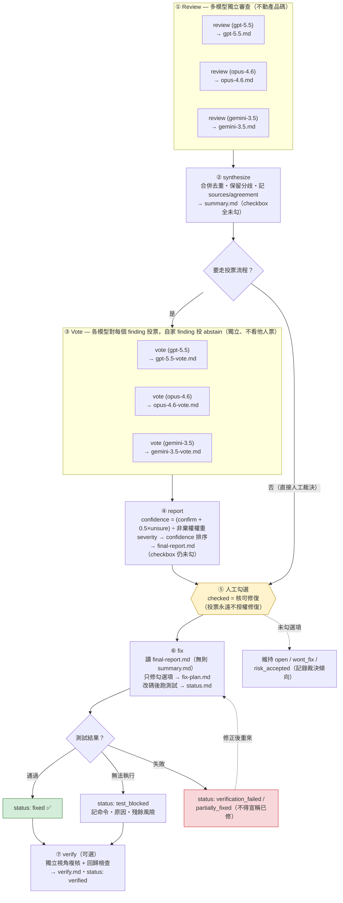

# Review Forge

`review-forge` is an Agent Skill for structured, auditable code review
workflows. It orchestrates multi-pass LLM review, finding synthesis,
human-approved fix selection, implementation, regression testing, independent
verification, and status tracking.

## What It Does

- Reviews local changes, branches, PRs, or commit ranges.
- Synthesizes multiple review perspectives into one fix checklist.
- Cross-votes findings between models to separate real issues from false positives.
- Ranks the final report by severity and weighted vote confidence.
- Uses checkboxes as the human approval boundary for fixes.
- Fixes only approved items.
- Requires tests after fixes unless testing is blocked and documented.
- Verifies fixes independently when possible.
- Keeps process artifacts isolated under `.review/`.

## Commands

- `review`: create one model-specific review file.
- `synthesize`: merge review files in one feature folder into `summary.md`.
- `vote`: one model votes confirm/dispute/unsure on `summary.md` findings it did not originate, into `<model>-vote.md`.
- `report`: aggregate votes into a confidence-ranked `final-report.md`.
- `fix`: fix checked items, run tests, and update status.
- `verify`: verify fixed items, inspect or rerun tests, and update status.

## Workflow



## Default Review Scope

When no target or base is specified:

1. If there are uncommitted or staged changes, Review Forge reviews the working
   tree diff.
2. If the working tree is clean, it reviews `main...HEAD`.
3. If `main` does not exist, it tries `master...HEAD`.
4. If no reasonable base can be inferred, it asks for one.

Explicit PRs, branches, commit ranges, or base refs always override these
defaults.

## Artifacts

Review Forge groups workflow files by feature under `.review/`:

```text
.review/<feature>/
  opus-4.6.md
  gpt-5.5.md
  gemini-3.5.md
  summary.md
  opus-4.6-vote.md
  gpt-5.5-vote.md
  gemini-3.5-vote.md
  final-report.md
  fix-plan.md
  verify.md
  status.md
```

Each model review should produce one file named after the model or agent. If
the same model runs multiple perspectives, use a suffix such as
`gpt-5.5-security.md`.

Command outputs are intentionally simple:

- `review` creates one model review file only, for example `gpt-5.5.md`.
- `synthesize` creates `summary.md` only.
- `vote` creates one vote file only, for example `gpt-5.5-vote.md`.
- `report` creates `final-report.md` only.
- `fix` reads `final-report.md` when present (otherwise `summary.md`), then
  creates or updates `fix-plan.md` and `status.md`.
- `verify` creates or updates `verify.md` and `status.md`.

Add `.review/` to the target repository's `.gitignore` unless you
intentionally want to commit review process files.

## Language Policy

The skill instructions, template field names, and machine-readable status enums
are in English. Generated reports can use `report_language: auto` to follow the
user's prompt language, or explicit values such as `en`, `zh-TW`, or `ja`.

Status values remain stable English enums, while display labels may be localized.

## Installation

This skill ships as the `review-forge` plugin in the `cc-copilot-plugins`
marketplace. In Claude Code:

```text
/plugin marketplace add gn00678465/cc-copilot-plugins
/plugin install review-forge@cc-copilot-plugins
```

For other clients that read cross-client Agent Skills, copy the skill folder
directly:

```sh
cp -R plugins/review-forge/skills/review-forge ~/.codex/skills/review-forge
```

Then invoke it from a compatible agent with:

```text
Use /review-forge to review this branch.
```

If a client does not support explicit `/skill` syntax, ask it to use the
`review-forge` skill or select it from the client's skills UI.

## Example Prompts

```text
Use /review-forge review feature: checkout-refactor model: codex.
```

```text
Use /review-forge review feature: checkout-refactor model: opencode perspective: security.
```

```text
Use /review-forge synthesize feature: checkout-refactor.
```

```text
Use /review-forge vote feature: checkout-refactor model: gpt-5.5.
```

```text
Use /review-forge report feature: checkout-refactor model_weights: gpt-5.5: 1.5.
```

```text
Use /review-forge fix feature: checkout-refactor.
```

```text
Use /review-forge verify feature: checkout-refactor.
```
