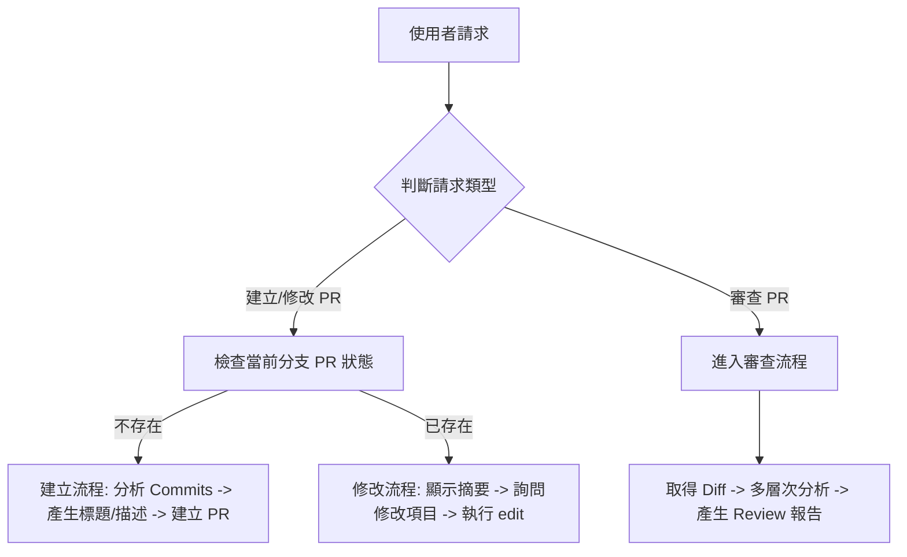

# GitHub Pull Request 助手 (v0.2.0)

協助使用者管理 Pull Request 生命週期，包含建立、修改及自動化程式碼審查。

## 功能

- **建立 PR**：遵循 Conventional Commits 規範，自動總結變更內容。
- **修改 PR**：更新現有 PR 的標題、描述、審核者或標籤。
- **PR 審查 (Review)**：分析 diff，檢查邏輯錯誤、程式碼品質及規範符合度。
- **狀態追蹤**：檢查當前分支的 PR 開啟狀態與 CI 檢查結果。

## 決策流程



---

## 標題規範 (Conventional Commits)

產生的標題必須符合以下格式：
`<type>(<scope>): <summary>`

### 類型 (Types)
- `feat`: 新功能
- `fix`: 修復 Bug
- `perf`: 效能優化
- `refactor`: 程式碼重構
- `docs`: 僅文件變更
- `test`: 測試相關
- `build`/`ci`: 建置系統或 CI 配置
- `chore`: 常規維護

### 規則
- **Breaking Change**: 若有破壞性變更，在冒號前加上 `!`，例如 `feat(api)!: 修改端點`。
- **Summary**: 使用祈使句（例：Add 而非 Added），首字母大寫，結尾不加句點。

---

## 建立 PR 流程

1. **分支同步**：確認已推送到遠端，若無則自動執行 `git push -u origin <branch>`。
2. **變更分析**：
   - 執行 `git log origin/main..HEAD --oneline` 取得 commit 清單。
   - 執行 `git diff --stat origin/main..HEAD` 取得檔案變更統計。
3. **內容產生**：參考 `references/pr-template.md` 產生 zh-TW 描述。
4. **執行建立**：
   - **必須**使用 `pr-body.md` 暫存檔，並透過 `gh pr create --body-file pr-body.md` 執行。

---

## PR 審查 (Review) 流程

當使用者要求「review PR」或「檢查程式碼」時執行：

1. **上下文獲取**：
   ```bash
   gh pr view <number> --json title,body,state
   gh pr diff <number>
   ```
2. **多層次審查**：
   - **Pass 1: 邏輯與錯誤**：檢查邊界條件、潛在 Bug、安全性問題 (SQLi, XSS)。
   - **Pass 2: 規範符合度**：檢查變更是否符合專案現有風格。
   - **Pass 3: 程式碼清晰度**：檢查命名、巢狀深度、重複邏輯。
3. **信心過濾**：僅回報信心度 > 80% 的問題。
4. **產生報告**：將結果寫入 `gh-pr-review.md`（不 commit），包含「摘要」、「議題清單」及「最終建議 (Verdict)」。

---

## 常用指令參考

詳細指令請參閱 `references/gh-pr-commands.md`。

| 功能 | 指令 |
|------|------|
| 檢查狀態 | `gh pr status` |
| 查看內容 | `gh pr view --json number,title,body` |
| 建立草稿 | `gh pr create --draft --body-file pr-body.md` |
| 修改標籤 | `gh pr edit <number> --add-label "bug,release"` |
| 查看 Diff | `gh pr diff <number>` |

---

## 注意事項

- **語言**：標題、描述及審查報告一律使用 **繁體中文 (zh-TW)**。
- **安全性**：絕對禁止在 PR 內容中洩漏 API Keys 或機密資訊。
- **暫存清理**：執行完 `gh` 指令後，務必刪除 `pr-body.md` 等暫存檔案。
